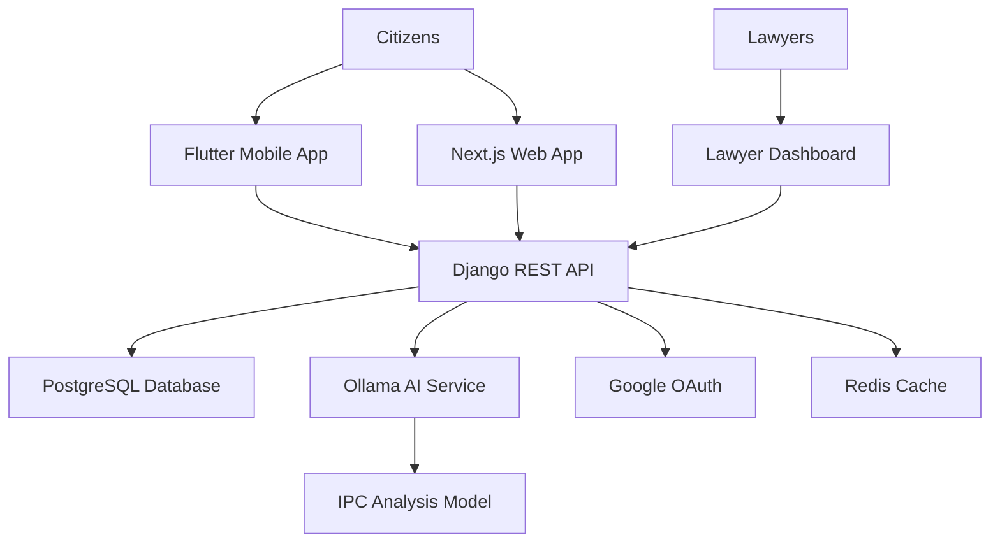

# Juris-Lead - IPC Justice Aid 🏛️⚖️

[](https://opensource.org/licenses/MIT)
[](https://djangoproject.com/)
[](https://flutter.dev/)
[](https://nextjs.org/)
[](https://docker.com/)
[](https://ollama.ai/)
[](https://developers.google.com/identity)

> **Democratizing access to justice through AI-powered legal analysis of Indian Penal Code**

**Juris-Lead** is a comprehensive legal-tech platform that provides free AI-powered legal case analysis under the Indian Penal Code (IPC) for citizens while creating quality lead generation opportunities for legal professionals. Built with Flutter for mobile, Next.js for web, and Django for the robust backend API.

## 🌟 Features

### For Citizens (Free Platform)

- 🤖 **AI-Powered IPC Analysis** - Analyze legal cases using Ollama-powered AI models
- 📄 **Structured Legal Reports** - Get detailed IPC section identification and explanations
- 🔒 **Anonymous Case Analysis** - Privacy-focused legal consultation without registration
- 📧 **Lawyer Lead Generation** - Connect citizens with legal professionals automatically
- 📱 **Cross-Platform Access** - Available on mobile (Flutter) and web (Next.js)
- 💬 **AI Legal Chatbot** - Multilingual legal assistant powered by Gemini AI

### For Legal Professionals (Lead Dashboard)

- 🎯 **Quality Filtered Leads** - Pre-screened legal cases from citizen submissions
- 🗂️ **Advanced Case Filtering** - Filter by IPC sections, location, case complexity
- 📊 **Lead Management Dashboard** - Track, manage and respond to client inquiries
- 💼 **Subscription Tiers** - Flexible pricing for solo practitioners to law firms
- 📈 **Analytics & Insights** - Case trends and legal market analytics
- 🤖 **AI-Assisted Case Review** - Quick case assessment and complexity evaluation

## 🏗️ Architecture



## 🛠️ Tech Stack

### Mobile Application (Flutter)

-  **Flutter 3.8.1** - Cross-platform mobile framework
-  **Dart 3.8.1** - Programming language
-  **Material Design 3** - Modern UI components
- **Google OAuth Integration** - Secure authentication
- **Shared Preferences** - Local data persistence

### Web Frontend (Next.js)

-  **Next.js 14** - React framework with SSR
-  **React 18** - Component-based UI library
-  **TypeScript** - Type-safe development
-  **Tailwind CSS** - Utility-first styling
- **Radix UI Components** - Accessible component library

### Backend API (Django)

-  **Django 4.2.7** - Python web framework
-  **Django REST Framework** - API development
-  **PostgreSQL** - Primary database
-  **Redis** - Caching and session management

### AI & Integration

-  **Ollama** - Local AI model serving for IPC analysis
-  **Gemini AI** - Chatbot and conversational AI
-  **Google OAuth 2.0** - Secure authentication
- **OCR Service** - Document text extraction using Tesseract
- **PDF Generation** - Legal report generation with ReportLab

### DevOps & Deployment

-  **Docker & Docker Compose** - Containerization
-  **Microsoft Azure** - Cloud deployment platform
-  **GitHub Actions** - CI/CD pipeline
- **Gunicorn & WhiteNoise** - Production WSGI server and static files

## 🚀 Quick Start

### Prerequisites

-  **Docker & Docker Compose** (Required - Backend runs in Docker)
-  **Ollama** installed locally for AI services
-  Node.js 18+ (for Next.js development)
-  Flutter SDK (for mobile development)
-  Python 3.11+ (optional - for local Django development)

### Installation

1. **Clone the repository**

   ```bash
   git clone https://github.com/AnupamSingh2004/ipc-justice-aid.git
   cd ipc-justice-aid
   ```

2. **Environment Setup**

   ```bash
   # Copy environment files
   cp ipc-justice-aid-backend/.env.example ipc-justice-aid-backend/.env
   cp frontend/.env.example frontend/.env
   cp next-frontend/.env.local.example next-frontend/.env.local
   ```

3. **Start Ollama AI Service**

   ```bash
   # Install and start Ollama (if not already installed)
   # Visit https://ollama.ai for installation instructions
   ollama serve
   
   # In another terminal, pull the required model
   ollama pull llama2
   ```

4. **Run the Complete Stack with Docker**

   ```bash
   # This will start Django backend in Docker along with PostgreSQL and Redis
   docker-compose up --build
   ```

5. **Access the applications**
   - Next.js Web Frontend: <http://localhost:3000>
   - Django API Documentation: <http://localhost:8000/api/docs/>
   - Django Admin Panel: <http://localhost:8000/admin/>

### Development Setup

#### Backend (Django API via Docker) - **Recommended**

```bash
# Backend runs in Docker with PostgreSQL and Redis
cd ipc-justice-aid-backend
docker-compose up --build

# For database migrations (run in Docker container)
docker-compose exec web python manage.py migrate
docker-compose exec web python manage.py createsuperuser
```

#### Alternative: Local Django Development

```bash
# Only if you prefer local development over Docker
cd ipc-justice-aid-backend
python -m venv venv
source venv/bin/activate  # On Windows: venv\Scripts\activate
pip install -r requirements.txt
python manage.py migrate
python manage.py runserver
```

#### Next.js Web Frontend

```bash
cd next-frontend
npm install
npm run dev
```

#### Flutter Mobile App

```bash
cd frontend
flutter pub get
flutter run
```

## 🔧 Configuration

### Docker Services

The backend runs in a Docker environment that includes:

- **Django Web Server** - Main API service
- **PostgreSQL Database** - Primary data storage
- **Redis Cache** - Session management and caching
- **Ollama Integration** - Connects to host Ollama service for AI

### Environment Variables

Create environment files in respective directories:

#### Backend (.env in ipc-justice-aid-backend/)

```env
# Django Settings
DJANGO_SECRET_KEY=your_secret_key_here
DJANGO_DEBUG=True
DATABASE_URL=postgresql://postgres:password@db:5432/juris_lead

# Docker Database Configuration (when using docker-compose)
POSTGRES_DB=juris_lead
POSTGRES_USER=postgres
POSTGRES_PASSWORD=password
POSTGRES_HOST=db
POSTGRES_PORT=5432

# Redis Configuration (Docker)
REDIS_URL=redis://redis:6379/1

# Ollama AI Configuration (connects to host)
OLLAMA_BASE_URL=http://host.docker.internal:11434
OLLAMA_MODEL_NAME=llama2

# Gemini AI for Chatbot
GEMINI_API_KEY=your_gemini_api_key_here

# Google OAuth
GOOGLE_OAUTH_CLIENT_ID=your_google_client_id
GOOGLE_OAUTH_CLIENT_SECRET=your_google_client_secret

# Email Configuration (Optional)
EMAIL_HOST=smtp.gmail.com
EMAIL_HOST_USER=your_email@gmail.com
EMAIL_HOST_PASSWORD=your_app_password

# Azure Deployment (Production)
AZURE_STORAGE_ACCOUNT_NAME=your_storage_account
AZURE_STORAGE_KEY=your_storage_key
```

#### Frontend (.env in frontend/)

```env
# API Configuration
API_BASE_URL=http://localhost:8000
NEXT_PUBLIC_API_URL=http://localhost:8000/api

# Google OAuth
GOOGLE_OAUTH_CLIENT_ID=your_google_client_id
GOOGLE_OAUTH_WEB_CLIENT_ID=your_web_client_id

# Gemini AI
GEMINI_API_KEY=your_gemini_api_key_here
```

## 📁 Project Structure

```text
juris-lead/
├── ipc-justice-aid-backend/      # Django REST API Backend
│   ├── authentication/           # User authentication & OAuth
│   ├── ipc_analysis/             # Core IPC analysis logic
│   │   ├── models.py            # Database models
│   │   ├── views.py             # API endpoints
│   │   ├── services.py          # Ollama AI service
│   │   ├── ocr_service.py       # Document OCR processing
│   │   └── document_summarizer_service.py  # AI document analysis
│   ├── leads/                   # Lawyer lead management
│   ├── profile_page/            # User profile management
│   ├── requirements.txt         # Python dependencies
│   └── manage.py               # Django management
├── frontend/                    # Flutter Mobile Application
│   ├── lib/
│   │   ├── models/             # Data models
│   │   ├── screens/            # App screens
│   │   │   ├── analyzer_screen.dart      # IPC analysis
│   │   │   ├── chatbot_screen.dart       # AI assistant
│   │   │   ├── explore_legal_cases_screen.dart
│   │   │   └── profile_screen_new_dynamic.dart
│   │   ├── services/           # API & business logic
│   │   │   ├── api_service.dart          # Backend API calls
│   │   │   ├── gemini_service.dart       # AI chatbot
│   │   │   └── google_auth_service.dart  # Authentication
│   │   └── widgets/            # Reusable UI components
│   └── pubspec.yaml           # Flutter dependencies
├── next-frontend/              # Next.js Web Application
│   ├── app/                   # App router pages
│   ├── components/            # React components
│   ├── lib/                   # Utilities
│   └── package.json          # Node.js dependencies
├── docker-compose.yml         # Multi-service deployment
└── README.md                 # This file
```

## 🧪 Testing

### Backend Tests

```bash
cd ipc-justice-aid-backend
python manage.py test
```

### Web Frontend Tests

```bash
cd next-frontend
npm run test
```

### Mobile App Tests

```bash
cd frontend
flutter test
```

## 📊 API Documentation

The API is fully documented using Django REST Framework's built-in documentation and Swagger. After running the backend server, visit:

- **Swagger UI**: `http://localhost:8000/api/docs/`
- **ReDoc**: `http://localhost:8000/api/redoc/`
- **Django Admin**: `http://localhost:8000/admin/`

### Key API Endpoints

- `POST /api/v1/citizens/analyze-case/` - Free IPC analysis for citizens
- `GET /api/v1/lawyers/leads/` - Fetch lawyer leads from citizen submissions
- `POST /api/v1/auth/google/` - Google OAuth authentication
- `POST /api/v1/analysis/document-summarizer/` - AI document analysis
- `GET /api/v1/legal-cases/` - Legal case database exploration
- `POST /api/v1/ocr/extract-text/` - OCR text extraction from images

## 🏆 Key Features Implemented

### ✅ Completed Features

- **🐳 Dockerized Backend** - Complete Django API stack in Docker containers
- **AI-Powered IPC Analysis** - Ollama-based legal case analysis
- **Multi-Platform Support** - Flutter mobile + Next.js web applications
- **Google OAuth Integration** - Secure user authentication
- **Dynamic User Profiles** - Real-time data synchronization
- **AI Legal Chatbot** - Gemini-powered multilingual assistant
- **Document Processing** - OCR and AI-powered document summarization
- **Legal Case Explorer** - Searchable database of landmark cases
- **Lawyer Lead Generation** - Automated lead creation from citizen cases
- **Real-time Statistics** - User activity tracking and analytics
- **Responsive Design** - Mobile-first UI/UX across all platforms

### 🚧 Development Status

- **Backend API**: ✅ Fully functional with Docker deployment
- **Docker Infrastructure**: ✅ PostgreSQL, Redis, Django web server
- **Mobile App**: ✅ Feature-complete with dynamic profiles and AI integration
- **Web Frontend**: ✅ Modern React-based interface with TypeScript
- **AI Integration**: ✅ Ollama + Gemini AI services operational
- **Database**: ✅ PostgreSQL with optimized schemas
- **Authentication**: ✅ Google OAuth with session management
- **Documentation**: ✅ Comprehensive API docs and deployment guides

## 🤝 Contributing

We welcome contributions! Please see our [Contributing Guidelines](CONTRIBUTING.md) for details.

1. Fork the repository
2. Create a feature branch (`git checkout -b feature/amazing-feature`)
3. Commit your changes (`git commit -m 'Add some amazing feature'`)
4. Push to the branch (`git push origin feature/amazing-feature`)
5. Open a Pull Request

## 📄 License

This project is licensed under the MIT License - see the [LICENSE](LICENSE) file for details.

## 🙏 Acknowledgments

- **Indian Penal Code** - Legal framework foundation
- **Ollama Community** - Local AI model serving platform
- **Flutter Team** - Cross-platform mobile development framework
- **Django REST Framework** - Robust API development tools
- **Google AI** - Gemini API for conversational AI
- **Open Source Community** - Various libraries and tools used

## 📞 Support & Contact

- 📧 **Email**: [support@juris-lead.com](mailto:support@juris-lead.com)
- 🐛 **Issues**: [GitHub Issues](https://github.com/AnupamSingh2004/ipc-justice-aid/issues)
- 📖 **Documentation**: [Project Wiki](https://github.com/AnupamSingh2004/ipc-justice-aid/wiki)
- 💬 **Discussions**: [GitHub Discussions](https://github.com/AnupamSingh2004/ipc-justice-aid/discussions)

---

## Made with ❤️ for accessible justice in India

[Back to top](#juris-lead---ipc-justice-aid-️️) • [Report Bug](https://github.com/AnupamSingh2004/ipc-justice-aid/issues) • [Request Feature](https://github.com/AnupamSingh2004/ipc-justice-aid/issues)